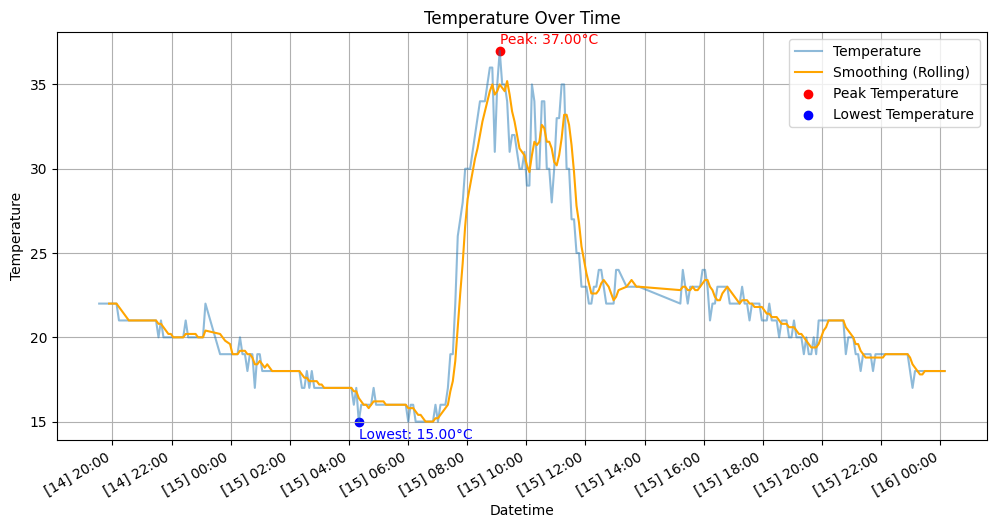

# 📊 DHT11 Temperature & Humidity Analysis

This project analyzes real-time data from the DHT11 sensor using Python and Google Colab.

📺 [Watch Project Demo](https://youtu.be/4h6vBeHDXIs)

## 🔧 Features
- Raw & smoothed temperature graph
- Peak/low temperature detection
- Time segmentation (morning/afternoon/night)

## ▶️ How to Run
1. Open in [Google Colab](https://colab.research.google.com/)
2. Upload your DHT11 CSV data
3. Run the notebook: `dht11_analysis.ipynb`

## 📷 Example Output

Place your output plots in the `images/` folder. For example:

## 📦 Requirements
See `requirements.txt` or run the notebook in Colab (recommended).

## 🧑‍💻 Author
Created by [Your Name] as part of a portfolio for master's scholarship to Japan 🇯🇵

